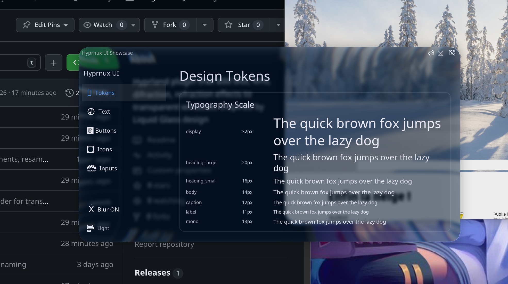

# MyGlass

A modern Apple-style Liquid Glass plugin for Hyprland.

[](https://github.com/Sidharth7082/myglass/actions/workflows/build.yml)
[](https://github.com/Sidharth7082/myglass/releases/latest)
[](https://hyprland.org)
[](LICENSE)

**MyGlass** is a modern Hyprland plugin that provides Apple-style Liquid Glass effects for windows and layer surfaces. It features SDF-based edge refraction, specular highlights, dynamic glass rendering, desaturation, and adaptive luminance controls — all completely customizable per-preset, per-theme, and per-layer.

---

## Features

- **Apple-inspired Liquid Glass effect**: SDF-based height fields, edge refraction, specular highlights, and edge chromatic dispersion.
- **Real-time blur rendering**: Efficient multi-pass Gaussian blur with damage-driven rendering and background caching.
- **Lua configuration API**: Configure seamlessly via `hl.plugin.myglass` in Hyprland Lua setups.
- **Custom glass presets**: Easily create and inherit custom glass presets for tailored window styles.
- **Layer-specific presets**: Apply frosted glass effects to Waybar, SwayNC, Quickshell, and desktop widgets.
- **Automatic loading through hyprpm**: Built directly against your running Hyprland version for full ABI compatibility.
- **Lightweight and fast**: High-performance shader pipeline with zero GPU overhead on idle/static windows.
- **Works across reboots**: Automatically persists and loads cleanly upon compositor restarts.
- **Configurable tint, brightness and blur**: Granular control over tint color, opacity, desaturation, vibrancy, dimming, and boost.
- **Open source**: Released under the BSD 3-Clause License.

---

## Screenshots




---

## Requirements

- **Hyprland** (latest)
- **hyprpm**
- **CMake**
- **Meson/Ninja** if required
- **GCC/Clang** (C++23 support)

---

## Installation

### Install using hyprpm

```bash
hyprpm add https://github.com/Sidharth7082/myglass
hyprpm update
hyprpm enable myglass
hyprctl reload
```

### Manual Building

```bash
git clone https://github.com/Sidharth7082/myglass.git
cd myglass
make -j$(nproc)
hyprctl plugin load $(pwd)/myglass.so
```

---

## Configuration

### 1. Lua Configuration (Hyprland 0.55+)

```lua
if hl.plugin.myglass then
    local hg = hl.plugin.myglass

    hg.config({
        default_theme = "dark",
        default_preset = "clear",
        tint_color = 0x8899aa22,

        brightness = 0.9,
        dark = { brightness = 0.82 },
        light = { adaptive_boost = 0.5 },

        layers = { enabled = true },
    })

    -- Layer surfaces: whitelist and configure per namespace
    hg.layer("waybar", { preset = "subtle", mask_threshold = 0.05 })
    hg.layer("swaync")
    hg.layer("quickshell:bezel", { preset = "ui", mask_threshold = 0.3 })
    hg.layer("debug-panel", { exclude = true })

    -- User-defined presets
    hg.preset("clear", {
        glass_opacity = 0.8,
        blur_strength = 1.5,
        dark = { brightness = 0.7 },
        light = { brightness = 1.2 },
    })

    hg.preset("contrasted", {
        inherits = "high_contrast",
        contrast = 1.2,
        adaptive_dim = 1.5,
        dark = { tint_color = 0x02142aa9 },
    })
end
```

### 2. Legacy `.conf` Configuration

```ini
plugin:myglass {
    default_theme = dark
    default_preset = clear
    tint_color = 0x8899aa22

    brightness = 0.9
    dark:brightness = 0.82
    light:adaptive_boost = 0.5

    preset = name:clear, glass_opacity:0.8, blur_strength:1.5
    preset = name:contrasted, inherits:high_contrast, contrast:1.2

    layers {
        enabled = 1
        namespaces = waybar, swaync, quickshell:bezel
        preset = subtle
    }
}
```

---

## Presets

| Preset | Description |
|---|---|
| `clear` | Transparent rounded glass plate with subtle edge refraction. |
| `subtle` | Light blur, minimal refraction, and soft highlights. |
| `high_contrast` | Punchy contrast, strong tinting, and crisp edge refraction. |
| `glass` | Thick glass block effect with high chromatic aberration. |

---

## Window Tags & Overrides

Custom rules can be attached per window via Hyprland window tags:

- **Enable / Disable**: `+myglass_enabled`, `+myglass_disabled`
- **Theme Selection**: `+myglass_theme_dark`, `+myglass_theme_light`
- **Preset Selection**: `+myglass_preset_<name>`

```bash
# Disable glass effect on mpv
hyprctl dispatch tagwindow +myglass_disabled

# Apply subtle preset to a specific window
hyprctl dispatch tagwindow +myglass_preset_subtle
```

---

## Troubleshooting

### Version Mismatch Notification
If Hyprland reports an ABI version mismatch, rebuild the plugin against your running Hyprland version:
```bash
hyprpm update
```

---

## License

Distributed under the [BSD 3-Clause License](LICENSE).

---

Author: **[Sidharth7082](https://github.com/Sidharth7082)** (Capture)
