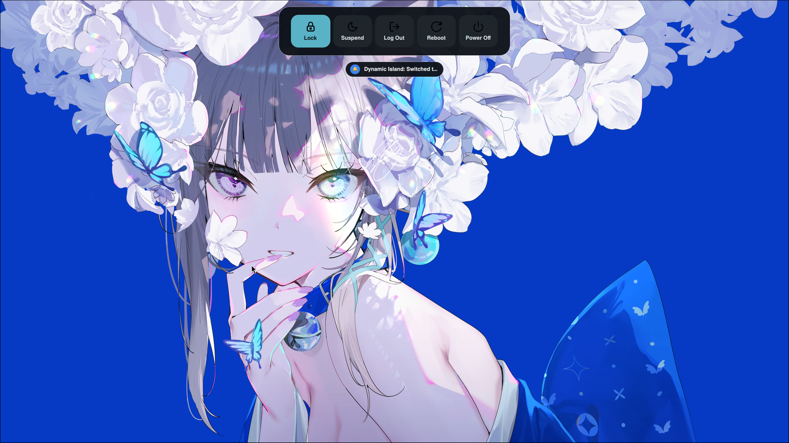

<div align="center">

# 🧊 MyGlass

### **Apple-Style Liquid Glass Effects for Hyprland**

*Turn your desktop into frosted, refractive, living glass — rendered in real time, right behind your windows.*

[](https://github.com/Sidharth7082/myglass/actions/workflows/build.yml)
[](https://github.com/Sidharth7082/myglass/releases)
[](https://github.com/Sidharth7082/myglass/stargazers)
[](https://github.com/Sidharth7082/myglass/releases)
[](LICENSE)
[](https://hyprland.org)
[](https://en.cppreference.com/w/cpp/23)

*Latest release: **v1.4.0** — crash-proof config reloading, correct version reporting & hardened GL pipeline*

[Configuration Guide →](CONFIG_GUIDE.md) · [Changelog →](CHANGELOG.md) · [Roadmap →](ROADMAP.md)

</div>

---

## 📑 Table of Contents

- [What is MyGlass?](#-what-is-myglass)
- [✨ Features](#-features)
- [🧠 How it works](#-how-it-works)
- [🖼️ Screenshots](#-screenshots)
- [📋 Requirements](#-requirements)
- [🚀 Installation](#-installation)
- [🎮 Usage](#-usage)
- [💎 Presets Reference](#-presets-reference)
- [🪟 Per-Window Control](#-per-window-control)
- [🧱 Layer-Surface Glass (Bars & Widgets)](#-layer-surface-glass-bars--widgets)
- [⚙️ Configuration](#-configuration)
- [⚡ Performance Notes](#-performance-notes)
- [🔄 Auto-Load On Every Startup](#-auto-load-on-every-startup)
- [🛠️ Troubleshooting](#-troubleshooting)
- [❓ FAQ](#-faq)
- [🗑️ Uninstall](#-uninstall)
- [📜 Version History](#-version-history)
- [📜 License & Credits](#-license--credits)

---

## 💎 What is MyGlass?

**MyGlass** is a native [Hyprland](https://hyprland.org) plugin that renders an **Apple-style liquid glass** effect behind your windows and layer surfaces (bars, widgets, menus). Instead of a flat translucent tint, MyGlass simulates a **thick convex slab of glass** in real time:

- **Frosted blur** — the background is blurred with a multi-pass gaussian (up to 5 iterations).
- **Edge refraction** — content near the window edges is pulled inward, like looking through curved glass, with per-channel **chromatic aberration** for that colored-rim look.
- **Fresnel rim glow & specular highlights** — light catches the top edge of the pane.
- **Adaptive brightness & vibrancy** — the glass responds to what's behind it.

Everything is computed **live on the GPU** with a custom GLES3 fragment shader, and heavily cached so an idle desktop costs almost nothing.

---

## ✨ Features

| Feature | Details |
|---|---|
| 🪟 **Real-time liquid glass** | Frosted blur, refraction, chromatic aberration, fresnel glow, specular highlights and lens distortion — rendered behind every window. |
| 💎 **6 built-in presets** | `clear`, `terminal_glass`, `subtle`, `acrylic`, `high_contrast`, `glass` — switchable at runtime, no reload needed. |
| 🪟 **Per-window control** | Tags to enable/disable glass, force a theme, or pin a preset to individual windows. |
| 🌗 **Dark / Light themes** | Theme-aware parameter overrides (brightness, contrast, saturation, adaptive dimming…) that adapt to your wallpaper and palettes. |
| 🧱 **Layer-surface glass** | Apply the effect to bars & widgets: Waybar, SwayNC, Dynamic Island layouts, wlogout, OSDs… |
| 🎛️ **Custom presets** | Define your own presets with inheritance (`inherits = "acrylic"`) from Lua or the legacy config. |
| ⚡ **Cache-first performance** | Per-monitor scene tracking reuses the blurred background when nothing behind the glass changed — an idle desktop costs ~0 extra GPU work. |
| 🛡️ **Crash-proof by design (v1.4.0)** | Exception-safe init/reload paths, no throws on the render thread, null-safe GL calls — a bad config can no longer take down Hyprland. |
| 📦 **One-command install** | Install via `hyprpm` or build the `.so` yourself in seconds. |

---

## 🧠 How it works

MyGlass hooks into Hyprland's render pipeline as a **window decoration** plus a **layer-surface render hook**:

1. **Sample** — before the window is composited, the live framebuffer behind it is captured into a small, padded FBO (downscaled 2× when the blur is strong enough to hide it).
2. **Blur** — a ping-pong gaussian blur runs over the sample (horizontal + vertical pass per iteration).
3. **Glass pass** — a full-screen quad draws the liquid-glass shader: refraction from the window's SDF edges, chromatic aberration, tint, fresnel, specular, inner shadow — masked to the window's rounded corners.
4. **Cache** — the blurred sample is cached per window/layer and invalidated only when the *scene behind it* changes (windows move, workspace animates, etc.), tracked via a per-monitor generation counter. This is what makes the effect cheap on idle desktops.

For **layer surfaces**, MyGlass additionally redirects the layer's own rendering into a temp FBO, then composites the glass *behind* the surface and the surface *on top* using the temp FBO's alpha as a mask — so glass only appears where the widget actually has visible content.

---

## 🖼️ Screenshots

| 🖥️ Desktop | 📊 Waybar Surface |
| :---: | :---: |
|  |  |

| 📈 btop System Monitor (Liquid Glass) | 🎛️ Pavucontrol (Smoked Glass HUD) |
| :---: | :---: |
|  |  |

| 🪟 Terminal Glass | 🔲 WLogout — Default | 🔲 WLogout — Glass |
| :---: | :---: | :---: |
|  |  |  |

---

## 📋 Requirements

- **Linux** running **Hyprland ≥ 0.53** (tested on **0.56.1**; see [`hyprpm.toml`](hyprpm.toml) for the exact pinned versions).
- **`hyprpm`** — ships with Hyprland. For manual builds you need **GCC 12+ / Clang** (C++23) and the Hyprland dev headers.
- A GPU with decent GLES3 support — integrated Intel and NVIDIA/AMD discrete GPUs all work.
- **For terminals/editors**: enable background transparency so the glass shows through (see [Neovim, btop & Terminal Setup](#-neovim-btop--terminal-setup)).

---

## 🚀 Installation

### ⚡ Option A — All-In-One One-Liner (Fastest)

Copy-paste this **single line** into a terminal and press `Enter`:

```bash
hyprpm add https://github.com/Sidharth7082/myglass && hyprpm update && hyprpm enable myglass && hyprctl reload
```

🎉 **That's it — MyGlass is installed and running!**

### 📋 Option B — Step-by-Step

```bash
hyprpm add https://github.com/Sidharth7082/myglass   # 1. Register the repository
hyprpm update                                        # 2. Download & build the plugin
hyprpm enable myglass                                # 3. Enable it
hyprctl reload                                       # 4. Reload Hyprland
```

Verify it's loaded:

```bash
hyprctl plugin list
```

You should see:

```
Plugin myglass by Capture:
    Handle: ...
    Version: 1.4.0
    Description: Apple-style Liquid Glass effect
```

### 🛠️ Option C — Build From Source

```bash
git clone https://github.com/Sidharth7082/myglass.git
cd myglass
make -j$(nproc)                            # produces myglass.so
hyprctl plugin load "$(pwd)/myglass.so"    # load for this session
```

To make a manual build permanent, add to your Hyprland config:

```ini
exec-once = hyprctl plugin load /path/to/myglass/myglass.so
```

> **Note:** for source builds you need the Hyprland development headers matching your Hyprland version. The easiest way is to let `hyprpm` manage everything (Options A/B).

---

## 🎮 Usage

### 🔀 Switching presets at runtime

The quickest way to change the glass style is to write the preset name to the state file and reload:

| Preset | Command |
|---|---|
| 💎 **Clear Glass** *(recommended)* | `echo "clear" > ~/.config/hypr/myglass_preset.state && hyprctl reload` |
| 💻 **Terminal Glass** (btop/terminals) | `echo "terminal_glass" > ~/.config/hypr/myglass_preset.state && hyprctl reload` |
| 🎨 **Subtle Glass** | `echo "subtle" > ~/.config/hypr/myglass_preset.state && hyprctl reload` |
| ❄️ **Acrylic Glass** | `echo "acrylic" > ~/.config/hypr/myglass_preset.state && hyprctl reload` |
| ⚡ **High Contrast Glass** | `echo "high_contrast" > ~/.config/hypr/myglass_preset.state && hyprctl reload` |
| 🪟 **Glass** | `echo "glass" > ~/.config/hypr/myglass_preset.state && hyprctl reload` |

### 🎛️ Toggle glass on/off for a window

| Action | Command |
|---|---|
| 🚫 Disable glass on the focused window | `hyprctl dispatch tagwindow +myglass_disabled` |
| ✨ Enable glass on the focused window | `hyprctl dispatch tagwindow +myglass_enabled` |

### ⌨️ Suggested keybind

Bind a key to toggle the whole plugin (see `scripts/toggle_myglass.sh` for a full toggle with notifications):

```ini
bind = SUPER, G, exec, ~/.config/hypr/scripts/toggle_myglass.sh
```

---

## 💎 Presets Reference

Presets are the heart of MyGlass. Each one is a named bundle of parameters; all values can be overridden per-window, per-theme, or via custom presets.

| Preset | Blur | Refraction | Chromatic AB | Fresnel | Specular | Glass Opacity | Style / Best Used For |
|---|---|---|---|---|---|---|---|
| 💎 **`clear`** *(default)* | `0.0` | `0.3` | `0.2` | `0.3` | `0.4` | — | Crystal-clear see-through glass, zero blur distortion. Wallpaper transparency & aesthetic setups. |
| 💻 **`terminal_glass`** | `0.06` | `0.3` | `0.15` | `0.2` | `0.3` | `0.05` | High text contrast, crisp edges. Terminals, `btop`, Neovim, code editors. |
| 🎨 **`subtle`** | `1.0` | `0.3` | `0.2` | `0.3` | `0.4` | — | Gentle background blur with a soft edge glint. Daily app windows, file managers. |
| ❄️ **`acrylic`** | `3.5` | `0.8` | `0.2` | `0.5` | `0.6` | `0.85` | Heavy Windows-style acrylic frosted diffusion (4 blur passes). Floating panels, popups, sidebars. |
| ⚡ **`high_contrast`** | `1.2` | `1.2` | `0.25` | `0.3` | `0.8` | `1.0` | Enhanced contrast (`1.14`), adaptive dimming (`0.25`). Bright wallpapers & light themes. |
| 🪟 **`glass`** | `1.0` | `8.0` | `0.5` | `0.4` | `0.8` | `1.0` | The classic liquid-glass look — strong refraction, full tint. Showcase effect. |

> `—` means the value falls through to the theme/global default.

---

## 🪟 Per-Window Control

Use Hyprland **window tags** (`hyprctl dispatch tagwindow`) to control glass per window:

| Tag | Effect |
|---|---|
| `myglass_enabled` | Force-enable glass on this window (overrides the global `enabled` setting). |
| `myglass_disabled` | Force-disable glass on this window — **always wins** if both tags are present. |
| `myglass_theme_dark` / `myglass_theme_light` | Force the dark/light theme variant for this window. |
| `myglass_preset_<name>` | Pin a preset (e.g. `myglass_preset_acrylic`) to this window. |

Example — pin the focused window to the acrylic preset:

```bash
hyprctl dispatch tagwindow +myglass_preset_acrylic
```

Dynamic tags (`tagwindow +firefox*`) work too — MyGlass normalizes the trailing `*` so `firefox` and `firefox*` resolve to the same preset.

---

## 🧱 Layer-Surface Glass (Bars & Widgets)

MyGlass can render glass behind **layer surfaces** — the Wayland surfaces bars, widgets, and panels use. This is what puts glass behind Waybar, SwayNC, Dynamic Island layouts, and wlogout.

### Enable layers (Lua)

```lua
if hl.plugin and hl.plugin.myglass then
    local hg = hl.plugin.myglass

    -- Glass behind specific namespaces, each with its own preset
    hg.layer("nowoward-capdynamic",              { preset = "clear" })
    hg.layer("nowoward-capdynamic-wallpaperpicker", { preset = "clear" })
    hg.layer("waybar",                           { preset = "subtle" })
    hg.layer("swaync")                           -- default preset

    -- Exclude a namespace entirely
    hg.layer("some-widget", { exclude = true })
end
```

### Enable layers (legacy config)

```ini
plugin:myglass {
    layers {
        enabled = 1
        namespaces = waybar, swaync, nowoward-capdynamic, nowoward-capdynamic-wallpaperpicker
        preset = clear
    }
}
```

### How layer glass works

For each matching layer, MyGlass:

1. Captures & blurs the background **before** the layer renders,
2. redirects the layer's own rendering into a temporary framebuffer,
3. composites glass **behind** the surface and the surface **on top**, using the temp framebuffer's alpha as a mask — so glass only appears where the widget has real content (no glass around invisible pixels).

You can fine-tune the mask per namespace:

```lua
hg.layer("nowoward-capdynamic", { preset = "clear", mask_threshold = 0.05 })
```

---

## ⚙️ Configuration

The full reference lives in the **[Configuration Guide](CONFIG_GUIDE.md)** — here's the quick tour.

### Lua (recommended)

`~/.config/hypr/module/myglass.lua` (or require it from `hyprland.lua`):

```lua
local state_file = (os.getenv("HOME") or "/home/capture") .. "/.config/hypr/myglass_enabled.state"
local f = io.open(state_file, "r")
local enabled_state = true
if f then
    local content = f:read("*all")
    f:close()
    if content and content:find("false") then
        enabled_state = false
    end
end

if hl.plugin and hl.plugin.myglass then
    local hg = hl.plugin.myglass

    -- Main settings
    hg.config({
        enabled = enabled_state,     -- master switch
        default_theme = "dark",      -- "dark" or "light"
        default_preset = "clear",    -- glass style
        tint_color = 0x00000000,     -- optional color tint (ARGB hex)
        glass_opacity = 0.09,        -- 0.0 (invisible) - 1.0 (full)
        blur_strength = 0.04,        -- background blur amount
        manage_window_blur = 0,      -- let MyGlass manage Hyprland's blur (1) or not (0)
    })

    if enabled_state then
        -- Liquid glass over Dynamic Island layer surfaces
        hg.layer("nowoward-capdynamic", { preset = "clear" })
        hg.layer("nowoward-capdynamic-wallpaperpicker", { preset = "clear" })
        hg.layer("nowoward-capdynamic-wlogout", { preset = "clear" })

        -- Liquid glass over Waybar & SwayNC
        hg.layer("waybar", { preset = "subtle" })
        hg.layer("swaync")
    end
end
```

### Legacy config (`hyprland.conf`)

```ini
plugin:myglass {
    default_theme = dark
    default_preset = clear
    tint_color = 0x00000000
    glass_opacity = 0.09
    blur_strength = 0.04

    layers {
        enabled = 1
        namespaces = waybar, swaync, nowoward-capdynamic, nowoward-capdynamic-wallpaperpicker, nowoward-capdynamic-wlogout
        preset = clear
    }
}
```

### Custom presets

Define your own presets from Lua, with inheritance:

```lua
-- Custom "my_frost" preset that inherits acrylic, then overrides
hg.preset("my_frost", {
    inherits = "acrylic",
    blur_strength = 2.0,
    glass_opacity = 0.7,
    dark = { brightness = 0.9 },
})
```

Then use it like any built-in: `echo "my_frost" > ~/.config/hypr/myglass_preset.state && hyprctl reload`

### Key config options at a glance

| Setting | Type | Default | Description |
|---|---|---|---|
| `enabled` | `boolean` | `true` | Master switch for the whole effect. |
| `default_theme` | `"dark"`/`"light"` | `"dark"` | Theme used when a window has no theme tag. |
| `default_preset` | `string` | `"default"` | Preset applied when no per-window preset matches. |
| `blur_strength` | `number` | `2.0` | Background blur amount (higher = frostier). |
| `blur_iterations` | `integer` | `3` | Gaussian blur passes (`1`–`5`). |
| `glass_opacity` | `number` | `1.0` | Overall opacity of the glass pane. |
| `tint_color` | `hex int` | `0x8899aa22` | Color tinted into the glass (AARRGGBB). |
| `refraction_strength` | `number` | `0.6` | Edge refraction intensity. |
| `chromatic_aberration` | `number` | `0.5` | Per-channel color fringing at edges. |
| `fresnel_strength` | `number` | `0.6` | Edge glow intensity. |
| `specular_strength` | `number` | `0.8` | Highlight brightness. |
| `lens_distortion` | `number` | `0.5` | Body curvature distortion. |
| `manage_window_blur` | `boolean` | `true` | When on, glassed windows get the `noblur` property so Hyprland composites them against the live framebuffer (correct glass on static windows). |

> Many settings also exist as `dark:` / `light:` overrides — see the [Configuration Guide](CONFIG_GUIDE.md) for the complete table.

---

## ⚡ Performance Notes

MyGlass is designed to be cheap on idle desktops:

- **Scene caching** — the blurred background is only recomputed when the scene *behind* the glass changes (per-monitor generation counter). A static window over a static wallpaper costs ~0 GPU work per frame.
- **Downsampled sampling** — when blur is strong enough (`blur_strength ≥ 0.35`), the sample FBO is rendered at half resolution, making each blur pass 4× cheaper.
- **Shared blur temp FBO** — one scratch framebuffer is reused across all decorations.
- **Capped blur iterations** — `blur_iterations` is clamped to `1..5` regardless of config.
- **Live blur for windows** — windows request live background re-renders so partial damage (e.g. typing in a window below) never leaves stale pixels inside the sampling padding.

If you notice stutter, start with the `subtle` or `clear` presets and raise `blur_iterations` only as needed.

---

## 🔄 Auto-Load On Every Startup

To keep MyGlass active automatically each time Hyprland starts:

### 📜 Lua Configuration

```lua
hl.on("hyprland.start", function ()
    hl.exec_cmd("hyprpm reload -n")
end)
```

### 📝 Legacy Config

```ini
exec-once = hyprpm reload -n
```

---

## 🛠️ Troubleshooting

<details>
<summary><b>1. The glass effect isn't showing up?</b></summary>

- Make sure the plugin is loaded: `hyprctl plugin list` should show `myglass` version `1.4.0`.
- Windows must be **translucent** — set a transparent background in your terminal/editor (see [Neovim, btop & Terminal Setup](#-neovim-btop--terminal-setup)).
- Confirm the effect is enabled: `hyprctl getoption plugin:myglass:enabled` should report `1`.
- Try a reload: `hyprpm update && hyprctl reload`.
</details>

<details>
<summary><b>2. MyGlass crashed Hyprland on an old version — is it fixed?</b></summary>

Yes. **v1.4.0** fixes a crash where an exception during config reload aborted the whole compositor (SIGABRT in `commitPendingPresets`). The init and reload paths are now exception-safe and a bad config only shows a notification. Update with `hyprpm update` and restart Hyprland.
</details>

<details>
<summary><b>3. `hyprctl plugin list` shows version 1.0.0 / an old version?</b></summary>

You're running a stale cached build. hyprpm only rebuilds when the pinned commit changes — run `hyprpm update` (v1.4.0 adds an explicit pin for Hyprland 0.56.1 so the matching release is always selected), then restart Hyprland.
</details>

<details>
<summary><b>4. Glass looks wrong on some windows (duplicate/ghosting)?</b></summary>

A v1.3.0 fix prevents duplicate glass decorations when a window's open event fires twice (e.g. remap). If you still see artifacts, reload Hyprland after updating and make sure you're not running two copies of the plugin (check `hyprctl plugin list`).
</details>

<details>
<summary><b>5. "Version mismatch!" notification on startup?</b></summary>

The plugin's ABI doesn't match your Hyprland build. Update Hyprland (or the plugin) so both sides match, then reload. Only for exotic setups: `MYGLASS_SKIP_VERSION_CHECK=1` downgrades the hard failure to a warning — **unsupported, can crash Hyprland**.
</details>

<details>
<summary><b>6. Nothing renders behind my terminal?</b></summary>

Terminals must be transparent themselves. For kitty:
```ini
# ~/.config/kitty/kitty.conf
background_opacity 0.75
```
For Neovim, force a transparent background:
```lua
-- ~/.config/nvim/init.lua
for _, group in ipairs({ "Normal", "NormalNC", "LineNr", "SignColumn", "NormalFloat" }) do
    vim.api.nvim_set_hl(0, group, { bg = "NONE", ctermbg = "NONE" })
end
```
</details>

---

## 💡 Neovim, btop & Terminal Setup

To render liquid glass cleanly behind **Neovim**, **btop** or terminals:

1. **Terminal**: enable background transparency, e.g. `background_opacity 0.75` in `~/.config/kitty/kitty.conf`.

2. **btop**: disable the solid background in `~/.config/btop/btop.conf`:
   ```ini
   color_theme = "tokyo-night"   # or the included high-contrast theme
   theme_background = false
   truecolor = true
   ```

3. **Neovim**: force transparent backgrounds (snippet above in Troubleshooting).

4. Use the **`terminal_glass`** preset for the sharpest text rendering: `echo "terminal_glass" > ~/.config/hypr/myglass_preset.state && hyprctl reload`

---

## ❓ FAQ

<details>
<summary><b>1. What are the system requirements?</b></summary>

- Any Linux distro running **Hyprland ≥ 0.53** (tested on 0.56.1).
- **GCC** or **Clang** (for source builds) and `hyprpm` (ships with Hyprland).
- A GPU with GLES3 support — Intel iGPU, NVIDIA, and AMD all work.
</details>

<details>
<summary><b>2. Does MyGlass work with NVIDIA?</b></summary>

Yes — the plugin uses standard GLES3 calls on Hyprland's existing GL context. Make sure Hyprland itself renders correctly on your NVIDIA setup first (use the `nvidia-drm.modeset=1` kernel param and Hyprland's NVIDIA guidance).
</details>

<details>
<summary><b>3. Will MyGlass slow down my desktop?</b></summary>

On an idle desktop, almost not at all — the blurred background is cached and only recomputed when the scene behind the glass changes (see [Performance Notes](#-performance-notes)). Heavy presets (`acrylic`, `high_contrast`) cost more per frame while animating.
</details>

<details>
<summary><b>4. How do I completely uninstall MyGlass?</b></summary>

```bash
hyprpm disable myglass
hyprpm remove myglass
hyprctl reload
```
</details>

<details>
<summary><b>5. Can I use MyGlass with other Hyprland plugins?</b></summary>

Generally yes — MyGlass only adds a window decoration and hooks `renderLayer` for layer surfaces. If another plugin also hooks rendering, order can matter; try disabling one at a time if you see artifacts.
</details>

<details>
<summary><b>6. Where do I report a bug?</b></summary>

Open an [issue](https://github.com/Sidharth7082/myglass/issues) with your Hyprland version (`hyprctl version`), plugin version (`hyprctl plugin list`), and the preset/config you're using. If Hyprland crashed, include the crash report from `~/.cache/hyprland/`.
</details>

---

## 🗑️ Uninstall

```bash
hyprpm disable myglass   # 1. Disable the plugin
hyprpm remove myglass    # 2. Remove it
hyprctl reload
```

---

## 📜 Version History

| Version | Date | Highlights |
|---|---|---|
| **v1.4.0** | 2026-08-05 | Crash-proof config reload (SIGABRT fix), correct version reporting, Hyprland 0.56.1 pin, exception & null-safety hardening, README overhaul |
| **v1.3.0** | 2026-08-05 | Fix duplicate glass decorations on window remap; README overhaul |
| **v1.2.0** | 2026-08-04 | `terminal_glass` & `acrylic` presets; pavucontrol Smoked Glass HUD; btop integration; preset state file |
| **v1.1.0** | 2026-07-31 | Renamed HyprGlass → MyGlass; Hyprland 0.56.1 compatibility; CI build workflow |
| **v1.0.0** | — | Initial release |

See [CHANGELOG.md](CHANGELOG.md) for the full details, and [ROADMAP.md](ROADMAP.md) for what's next.

---

## 🤝 Contributing & Support

- 🐛 Found a bug? Open an [issue](https://github.com/Sidharth7082/myglass/issues) — include your Hyprland version and `hyprctl plugin list` output.
- ✨ Want a feature? Check the [roadmap](ROADMAP.md) and open a discussion.
- 🔧 Pull requests welcome — keep changes focused and run `make` before submitting (CI builds every push on `main`/`dev`).

---

## 📜 License & Credits

- Created by **[Sidharth7082](https://github.com/Sidharth7082)** (Capture)
- Free and Open Source under the **[BSD 3-Clause License](LICENSE)**
- Built with 💙 for the Hyprland community
