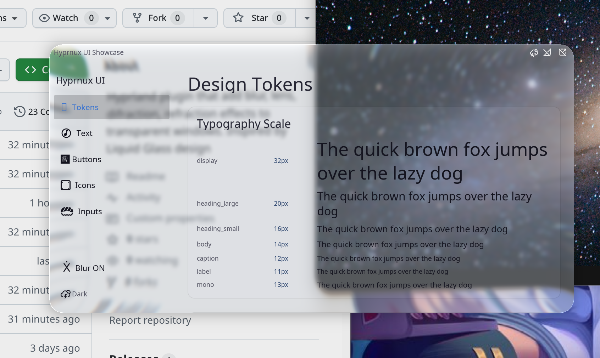

# MyGlass - Liquid Glass plugin for Hyprland

[](https://github.com/Sidharth7082/myglass/actions/workflows/build.yml)
[](https://github.com/Sidharth7082/myglass/releases/latest)
[](https://hyprland.org)
[](LICENSE)

An Apple-inspired **Liquid Glass** decoration plugin for [Hyprland](https://hyprland.org/).

Frosted glass blur, edge refraction, chromatic aberration, specular highlights, and adaptive contrast — fully customizable per-theme, per-preset, and per-window/layer.

| Dark Theme | Light Theme |
|:---:|:---:|
|  |  |

---

## Features

- 🧊 **SDF-Based Glass Refraction**: Realistic edge refraction and chromatic aberration with convex height fields.
- 🎨 **Dual-Theme Engine**: Native `dark` and `light` theme profiles with luminance-adaptive brightness, contrast, and vibrancy.
- ⚡ **Lua First-Class Integration**: Configure effortlessly in Hyprland Lua setups via `hl.plugin.myglass`.
- 🪟 **Layer Surface Support**: Apply frosted glass effects to Waybar, SwayNC, Quickshell, and desktop widgets.
- 🎯 **Per-Window Controls**: Dynamic preset, theme, and enable/disable overrides using Hyprland window tags.
- ⚙️ **Custom Presets**: Built-in presets (`clear`, `subtle`, `high_contrast`, `glass`) plus user-defined preset inheritance.
- 🚀 **High Performance**: Two-pass Gaussian blur with padded sampling and damage-driven rendering.

---

## Installation

### 1. hyprpm (Recommended)

Builds directly against your running Hyprland version for seamless ABI compatibility:

```bash
hyprpm add https://github.com/Sidharth7082/myglass
hyprpm enable myglass
```

### 2. Pre-built Release

Download `myglass.so` from [Releases](https://github.com/Sidharth7082/myglass/releases/latest).

Load dynamically:
```bash
hyprctl plugin load /path/to/myglass.so
```

Or persist in your Hyprland configuration file:
```ini
plugin = /path/to/myglass.so
```

### 3. Manual Building

Build from source using standard tools:

```bash
git clone https://github.com/Sidharth7082/myglass.git
cd myglass
make -j$(nproc)
hyprctl plugin load $(pwd)/myglass.so
```

---

## Building

### Requirements
- **C++ Compiler**: GCC (with C++23 support)
- **Build Tools**: `make`, `pkg-config`
- **Dependencies**: `hyprland`, `pixman-1`, `libdrm`

To compile:
```bash
make clean
make -j$(nproc)
```

---

## Configuration

### 1. Lua Configuration (Hyprland 0.55+)

The plugin must be loaded before executing configuration calls. Wrap calls in a plugin check:

```lua
if hl.plugin.myglass then
    local hg = hl.plugin.myglass

    hg.config({
        default_theme = "dark",
        default_preset = "clear",
        tint_color = 0x8899aa22,

        brightness = 0.9,
        dark = { brightness = 0.82 },
        light = { adaptive_boost = 0.5 },

        layers = { enabled = true },
    })

    -- Layer surfaces: whitelist and configure per namespace
    hg.layer("waybar", { preset = "subtle", mask_threshold = 0.05 })
    hg.layer("swaync")
    hg.layer("quickshell:bezel", { preset = "ui", mask_threshold = 0.3 })
    hg.layer("debug-panel", { exclude = true })

    -- User-defined presets
    hg.preset("clear", {
        glass_opacity = 0.8,
        blur_strength = 1.5,
        dark = { brightness = 0.7 },
        light = { brightness = 1.2 },
    })

    hg.preset("contrasted", {
        inherits = "high_contrast",
        contrast = 1.2,
        adaptive_dim = 1.5,
        dark = { tint_color = 0x02142aa9 },
    })
end
```

### 2. Legacy `.conf` Configuration

```ini
plugin:myglass {
    default_theme = dark
    default_preset = clear
    tint_color = 0x8899aa22

    brightness = 0.9
    dark:brightness = 0.82
    light:adaptive_boost = 0.5

    preset = name:clear, glass_opacity:0.8, blur_strength:1.5
    preset = name:clear:dark, brightness:0.7
    preset = name:clear:light, brightness:1.2

    preset = name:contrasted, inherits:high_contrast, contrast:1.2, adaptive_dim:1.5
    preset = name:contrasted:dark, tint_color:0x02142aa9

    layers {
        enabled = 1
        namespaces = waybar, swaync, quickshell:bezel
        exclude_namespaces = debug-panel
        preset = subtle
        namespace_presets = quickshell:bezel:ui
        namespace_mask_thresholds = waybar=0.05, quickshell:bezel=0.3
    }
}
```

---

## Settings Reference

### Global Settings

| Option | Type | Default | Description |
|---|---|---|---|
| `enabled` | bool | `true` | Enable/disable the effect globally. Per-window tags override this. |
| `manage_window_blur` | bool | `true` | Automatically sets `noblur` property on glassed windows so glass replaces compositor blur. |
| `default_theme` | string | `dark` | Default theme: `dark` or `light`. |
| `default_preset` | string | `default` | Default preset name. |

### Overridable Settings

Settings resolve through: **preset chain** $\rightarrow$ **theme override** $\rightarrow$ **global value** $\rightarrow$ **hardcoded default**.

| Option | Type | Global Default | Dark Default | Light Default | Description |
|---|---|---|---|---|---|
| `blur_strength` | float | `2.0` | — | — | Blur radius scale |
| `blur_iterations` | int | `3` | — | — | Gaussian blur passes (1-5) |
| `refraction_strength` | float | `0.6` | — | — | Edge refraction intensity (0.0-1.0) |
| `chromatic_aberration` | float | `0.5` | — | — | Spectral dispersion at edges (0.0-1.0) |
| `fresnel_strength` | float | `0.6` | — | — | Edge glow intensity (0.0-1.0) |
| `specular_strength` | float | `0.8` | — | — | Specular highlight brightness (0.0-1.0) |
| `glass_opacity` | float | `1.0` | — | — | Overall glass opacity (0.0-1.0) |
| `edge_thickness` | float | `0.06` | — | — | Bezel width fraction (0.0-0.15) |
| `tint_color` | color | `0x8899aa22` | — | — | Glass tint RRGGBBAA hex |
| `lens_distortion` | float | `0.5` | — | — | Center dome magnification (0.0-1.0) |
| `brightness` | float | — | `0.82` | `1.12` | Brightness multiplier |
| `contrast` | float | — | `0.90` | `0.92` | Contrast midpoint modifier |
| `saturation` | float | — | `0.80` | `0.85` | Desaturation (0 = grayscale, 1 = full) |
| `vibrancy` | float | — | `0.15` | `0.12` | Selective saturation boost |
| `vibrancy_darkness` | float | — | `0.0` | `0.0` | Vibrancy influence on dark areas |
| `adaptive_dim` | float | — | `0.4` | `0.0` | Dims bright areas behind glass |
| `adaptive_boost` | float | — | `0.0` | `0.4` | Boosts dark areas behind glass |

---

## Window Tags & Overrides

Custom rules can be attached per window via Hyprland window tags:

- **Enable / Disable**: `+myglass_enabled`, `+myglass_disabled`
- **Theme Selection**: `+myglass_theme_dark`, `+myglass_theme_light`
- **Preset Selection**: `+myglass_preset_<name>`

### Examples

**Lua:**
```lua
hl.window_rule({ match = { class = "mpv" },       tag = "+myglass_disabled" })
hl.window_rule({ match = { class = "firefox" },    tag = "+myglass_theme_light" })
hl.window_rule({ match = { class = "kitty" },      tag = "+myglass_preset_high_contrast" })
```

**Dispatch on the fly:**
```bash
hyprctl dispatch tagwindow +myglass_disabled
hyprctl dispatch tagwindow +myglass_preset_subtle
```

---

## Presets

| Preset | Description |
|---|---|
| `high_contrast` | Punchy colors, strong tinting, sharp edge refraction. |
| `subtle` | Light blur, minimal refraction and highlights. |
| `clear` | Transparent rounded glass plate with subtle bezel refraction. |
| `glass` | Thick glass block effect with high chromatic aberration. |

---

## Performance Notes

- Glass rendering uses a two-pass Gaussian blur combined with single-pass shader compositing.
- On low-power GPUs, lowering `blur_iterations` from `3` to `2` or `1` significantly reduces frame render times.
- Padded background resampling occurs when windows move or resize. Static windows remain cached with zero GPU redraw overhead.

---

## Troubleshooting

### Version Mismatch Notification
If Hyprland notifies about an ABI version mismatch, rebuild the plugin against your running Hyprland version via `hyprpm update` or `make`. To force loading on custom git builds at your own risk, set `MYGLASS_SKIP_VERSION_CHECK=1` in your session environment.

### Glass Effect Not Showing
Ensure window translucency or transparency is enabled. If `manage_window_blur = false` is configured, manually add `windowrule = noblur, <window>` so compositor blur caching does not cover the glass decoration.

---

## FAQ

**Q: Does MyGlass work with Hyprland 0.56+?**  
A: Yes! MyGlass is fully tested and maintained for Hyprland 0.56.1 and above.

**Q: Can I use MyGlass with Waybar or SwayNC?**  
A: Yes, set `layers.enabled = true` in Lua config and add your bar's namespace via `hg.layer("waybar")`.

---

## Unloading

```bash
hyprctl plugin unload /path/to/myglass.so
```

---

## License

Distributed under the [BSD 3-Clause License](LICENSE).
