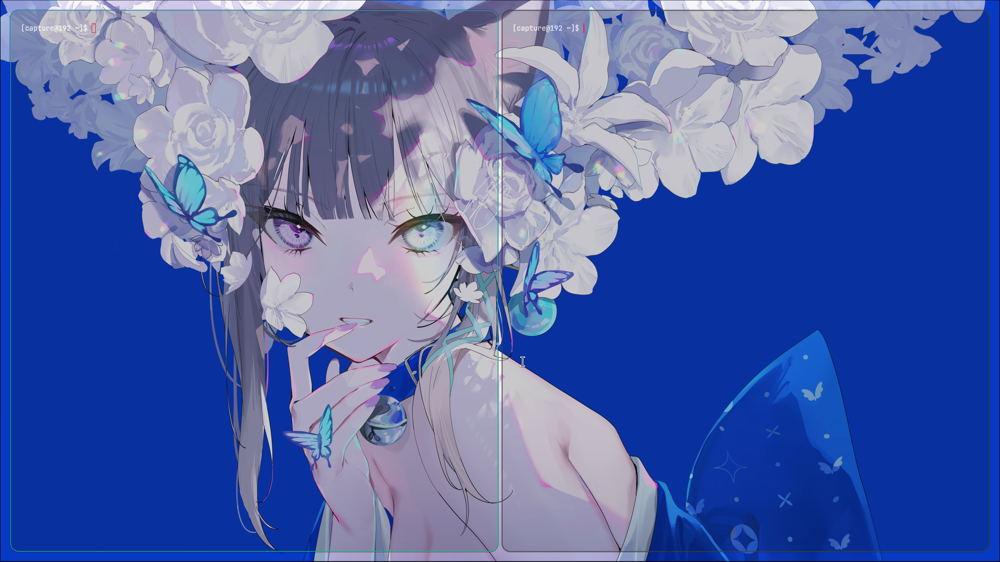
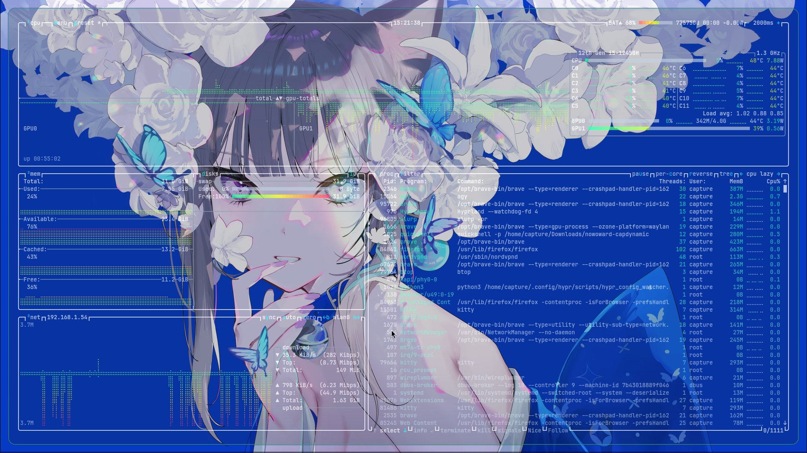
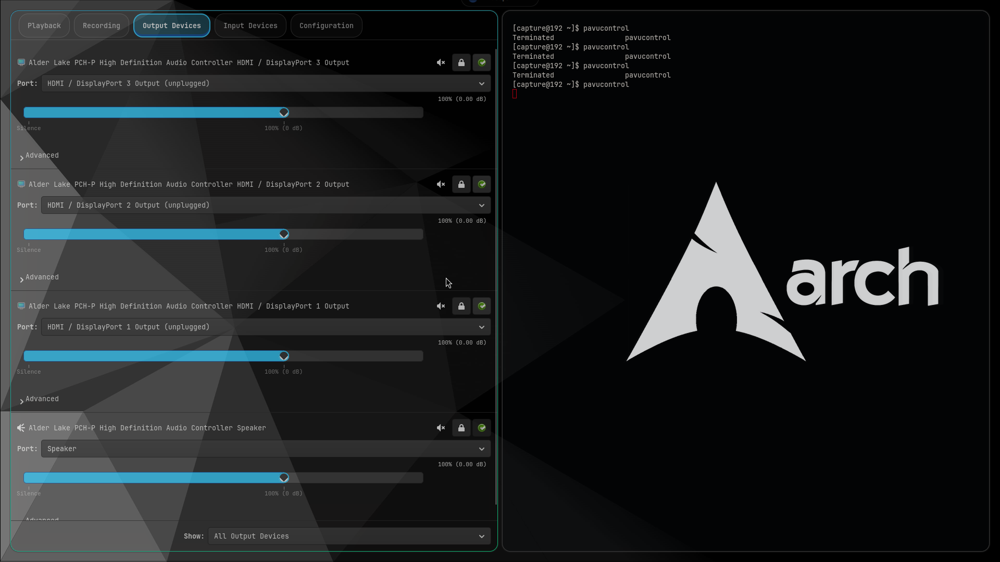

<div align="center">

# 🧊 MyGlass

### **Apple-Style Liquid Glass Effects for Hyprland**

*Make your windows look like shiny frosted liquid glass in seconds!*

[](https://github.com/Sidharth7082/myglass/actions/workflows/build.yml)
[](https://github.com/Sidharth7082/myglass/releases)
[](https://github.com/Sidharth7082/myglass/stargazers)
[](LICENSE)
[](https://hyprland.org)

[Configuration Guide →](CONFIG_GUIDE.md)

</div>

---

## 📑 Table of Contents

- [Features](#-features)
- [Screenshots](#-screenshots)
- [Requirements](#-requirements)
- [Quick Install](#-quick-install)
- [Usage](#-usage)
- [Presets Overview](#-available-presets-overview)
- [Auto-Load on Startup](#-auto-load-on-every-startup)
- [Configuration](#-configuration)
- [Neovim, btop & Terminal Setup](#-neovim-btop--terminal-setup)
- [Uninstall](#-uninstall)
- [Build from Source](#-build-from-source)
- [FAQ & Fixes](#-faq--fixes)
- [License & Credits](#-license--credits)

---

## ✨ Features

- **Real-time liquid glass** — frosted blur, refraction, chromatic aberration, fresnel rim glow and specular highlights rendered live behind your windows.
- **Built-in presets** — `clear`, `terminal_glass`, `subtle`, `acrylic` and `high_contrast`, switchable at runtime.
- **Per-window control** — use window tags to enable/disable glass or force a preset/theme on individual windows.
- **Dark / Light themes** — theme-aware overrides so glass adapts to your palettes.
- **Layer-surface glass** — apply the effect to bars & widgets (Waybar, SwayNC, Dynamic Island layouts).
- **Cache-first performance** — per-monitor scene tracking reuses the blurred background when nothing changed behind the glass.
- **One command install** — works with `hyprpm`, npm or Homebrew-style native builds.

---

## 🖼️ Screenshots

| 🖥️ Desktop | 📊 Waybar Surface |
| :---: | :---: |
|  |  |

| 📈 btop System Monitor (Liquid Glass) | 🎛️ Pavucontrol (Smoked Glass HUD) |
| :---: | :---: |
|  |  |

---

## 📋 Requirements

- **Linux** running **Hyprland** (tested up to 0.56.x; see [`hyprpm.toml`](hyprpm.toml) for pinned versions).
- **`hyprpm`** — ships with Hyprland. Native builds require **GCC/Clang**.
- For terminals, enable a transparent background (see [below](#-neovim-btop--terminal-setup)).

---

## 🚀 Quick Install

### ⚡ Option A: The All-In-One Single Command (Fastest)

Copy-paste this **single line** into a terminal and press `Enter`:

```bash
hyprpm add https://github.com/Sidharth7082/myglass && hyprpm update && hyprpm enable myglass && hyprctl reload
```

🎉 **That's it! MyGlass is installed and working!**

### 📋 Option B: Step-by-Step Install

```bash
hyprpm add https://github.com/Sidharth7082/myglass  # 1. Add repository
hyprpm update                                      # 2. Download & build
hyprpm enable myglass                              # 3. Enable the plugin
hyprctl reload                                     # 4. Reload Hyprland
```

---

## 🎮 Usage

Turn glass on/off for a specific window, or switch styles live:

| Action | Command |
|---|---|
| 🚫 Disable glass on the focused window | `hyprctl dispatch tagwindow +myglass_disabled` |
| ✨ Enable glass on the focused window | `hyprctl dispatch tagwindow +myglass_enabled` |
| 💎 Set **Clear Glass** (recommended) | `echo "clear" > ~/.config/hypr/myglass_preset.state && hyprctl reload` |
| 💻 Set **Terminal Glass** (btop/terminals) | `echo "terminal_glass" > ~/.config/hypr/myglass_preset.state && hyprctl reload` |
| 🎨 Set **Subtle Glass** | `echo "subtle" > ~/.config/hypr/myglass_preset.state && hyprctl reload` |
| ❄️ Set **Acrylic Glass** | `echo "acrylic" > ~/.config/hypr/myglass_preset.state && hyprctl reload` |
| ⚡ Set **High Contrast Glass** | `echo "high_contrast" > ~/.config/hypr/myglass_preset.state && hyprctl reload` |

---

## 💎 Available Presets Overview

| Preset | Character & Style | Best Used For |
|---|---|---|
| 💎 **`clear`** *(Recommended)* | Crystal clear see-through glass, zero blur distortion. | Wallpaper transparency, aesthetic setups. |
| 💻 **`terminal_glass`** | High text contrast, low distortion & crisp text. | Terminals, `btop`, Neovim, code editors. |
| 🎨 **`subtle`** | Gentle background blur (`1.0`) with soft edge glint. | Daily app windows, file managers. |
| ❄️ **`acrylic`** | Heavy Windows-style acrylic frosted diffusion (`3.5` blur). | Floating panels, popups, sidebars. |
| ⚡ **`high_contrast`** | Enhanced contrast multiplier & adaptive dimming. | Bright wallpapers & white themes. |

---

## 🔄 Auto-Load On Every Startup

To keep MyGlass active automatically each time Hyprland starts:

### 📜 Lua Configuration (`autostart.lua`)

```lua
hl.on("hyprland.start", function ()
    hl.exec_cmd("hyprpm reload -n")
end)
```

### 📝 Legacy Config (`hyprland.conf`)

```ini
exec-once = hyprpm reload -n
```

---

## ⚙️ Configuration

You can configure MyGlass from Lua (`module/myglass.lua` / `hyprland.lua`) or the legacy `hyprland.conf` snippet. **See the [full Configuration Guide](CONFIG_GUIDE.md) for every parameter.**

📜 Lua (`module/myglass.lua`):

```lua
local state_file = (os.getenv("HOME") or "/home/capture") .. "/.config/hypr/myglass_enabled.state"
local f = io.open(state_file, "r")
local enabled_state = true
if f then
    local content = f:read("*all")
    f:close()
    if content and content:find("false") then
        enabled_state = false
    end
end

if hl.plugin and hl.plugin.myglass then
    local hg = hl.plugin.myglass

    -- Main Settings
    hg.config({
        enabled = enabled_state,
        default_theme = "dark",      -- "dark" or "light"
        default_preset = "clear",     -- Glass style
        tint_color = 0x00000000,      -- Clear glass tint
        glass_opacity = 0.09,         -- Transparency opacity
        blur_strength = 0.04,         -- Background blur strength
    })

    if enabled_state then
        -- Liquid glass over Dynamic Island layer surfaces
        hg.layer("nowoward-capdynamic", { preset = "clear" })
        hg.layer("nowoward-capdynamic-wallpaperpicker", { preset = "clear" })
        hg.layer("nowoward-capdynamic-wlogout", { preset = "clear" })

        -- Liquid glass over Waybar & SwayNC
        hg.layer("waybar", { preset = "subtle" })
        hg.layer("swaync")
    end
end
```

📝 Legacy (`hyprland.conf`):

```ini
plugin:myglass {
    default_theme = dark
    default_preset = clear
    tint_color = 0x00000000
    glass_opacity = 0.09
    blur_strength = 0.04

    layers {
        enabled = 1
        namespaces = waybar, swaync, nowoward-capdynamic, nowoward-capdynamic-wallpaperpicker, nowoward-capdynamic-wlogout
        preset = clear
    }
}
```

---

## 💡 Neovim, btop & Terminal Setup

To render liquid glass cleanly behind **Neovim**, **btop** or terminals:

1. Enable background transparency in your terminal (e.g. `background_opacity 0.75` in `~/.config/kitty/kitty.conf`).

2. **btop**: disable the solid background in `~/.config/btop/btop.conf`:
   ```ini
   color_theme = "tokyo-night"  # or high-contrast theme
   theme_background = false
   truecolor = true
   ```

3. **Neovim**: force transparent background in `~/.config/nvim/init.lua`:
   ```lua
   -- Force transparent background in Neovim for MyGlass
   for _, group in ipairs({ "Normal", "NormalNC", "LineNr", "SignColumn", "NormalFloat" }) do
       vim.api.nvim_set_hl(0, group, { bg = "NONE", ctermbg = "NONE" })
   end
   ```

---

## 🗑️ Uninstall

```bash
hyprpm disable myglass   # 1. Disable the plugin
hyprpm remove myglass    # 2. Remove it
hyprctl reload
```

---

## 🛠️ Build From Source

```bash
git clone https://github.com/Sidharth7082/myglass.git
cd myglass
make -j$(nproc)                              # build myglass.so
hyprctl plugin load $(pwd)/myglass.so        # load it (with $XDG_RUNTIME_DIR set)
```

---

## ❓ FAQ & Fixes

<details>
<summary><b>1. The glass effect isn't showing up?</b></summary>

Make sure your windows are slightly transparent or translucent. You can also run:
```bash
hyprpm update && hyprctl reload
```
</details>

<details>
<summary><b>2. How do I completely uninstall MyGlass?</b></summary>

Run these two commands in your terminal:
```bash
hyprpm disable myglass
hyprpm remove myglass
```
</details>

<details>
<summary><b>3. What are the system requirements?</b></summary>

- Any Arch/Linux distro running **Hyprland**
- **GCC** or **Clang** compiler
- `hyprpm` (included automatically with Hyprland)
</details>

---

## 📜 License & Credits

- Created by **[Sidharth7082](https://github.com/Sidharth7082)** (Capture)
- Free and Open Source under the **[BSD 3-Clause License](LICENSE)**