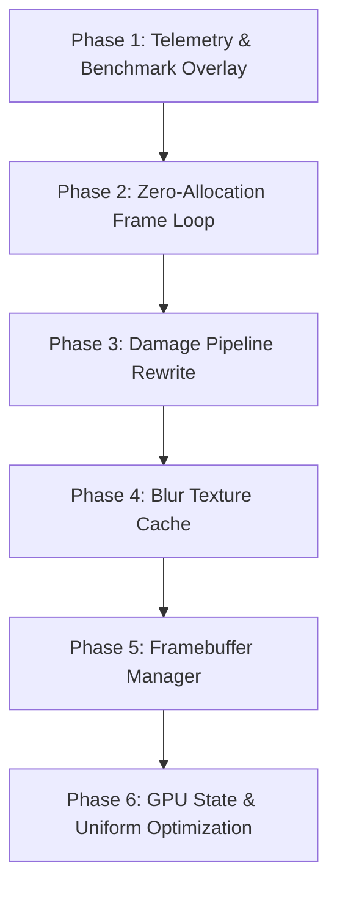

# MyGlass v1.2.0 — Performance Edition Architecture Plan

> **Core Goal**: *"Same visuals, significantly lower GPU usage, lower RAM usage, and faster rendering."*

---

## 🎯 Success Criteria for v1.2.0

- ✅ **Zero Heap Allocations**: 0 heap allocations (`new`, `delete`, `vector` allocations, `std::string` creation) during active frame render loops.
- ✅ **Damage-Driven Blurring**: Only blur damaged FBO regions instead of full window geometries.
- ✅ **Blur Texture Caching**: Reuse previous blur textures on static desktops when scene generation hasn't changed.
- ✅ **Minimal OpenGL State Shifts**: Eliminate redundant FBO, shader, texture binds, and `glUniform` uploads.
- ✅ **Integrated Telemetry & Debug Overlay**: Real-time performance stats in debug builds.

---

## 🏗️ Phased Development Roadmap



---

### Phase 1 — Benchmark First & Telemetry Overlay ⭐⭐⭐⭐⭐
- **Objective**: Establish empirical baseline measurements before making performance modifications.
- **Metrics Tracked**:
  - CPU frame time & GPU render pass time
  - Number of blur passes executed
  - Active FBO and texture allocations
  - VRAM & RAM usage
  - Total OpenGL draw calls
  - Number of windows & layer surfaces processed
  - Number of damaged regions
- **Developer Debug Overlay**: Optional debug overlay rendering live stats:
  ```text
  MyGlass Debug
  FPS: 165 | CPU: 4.2 ms | GPU: 2.8 ms
  Blur passes: 12 | Draw calls: 38
  FBOs: 4 | VRAM: 84 MB | Damage: 3 regions
  ```

---

### Phase 2 — Zero Allocation Frame Loop ⭐⭐⭐⭐⭐
- **Objective**: Guarantee zero heap allocations during normal frame rendering loops.
- **Action Items**:
  - Eliminate `new` / `delete` per frame.
  - Eliminate `std::vector::reserve` / `resize` inside `renderLayer` and `applyGlassEffect`.
  - Replace `std::unordered_map` insertions with fixed-size inline arrays or pre-allocated lookups.
  - Eliminate `std::string` / `std::format` string construction in rendering codepaths.

---

### Phase 3 — Damage Pipeline Rewrite ⭐⭐⭐⭐⭐
- **Objective**: Rewrite the render pipeline to calculate exact damage regions before executing blur passes.
- **Flow**:
  1. Receive compositor damage clip rects.
  2. Crop background sampling to damaged bounding boxes.
  3. Run two-pass Gaussian blur on damaged regions only.
  4. Composite updated glass quad to target framebuffer.
- **Expected Gain**: **20–50% GPU load reduction**.

---

### Phase 4 — Blur Texture Cache ⭐⭐⭐⭐⭐
- **Objective**: Retain previously computed blur textures for static windows and layer surfaces.
- **Invalidation Triggers**:
  - Window position or size changes.
  - Scene generation counter incremented (underlying desktop contents moved/updated).
  - Config / preset change.

---

### Phase 5 — Framebuffer Manager ⭐⭐⭐⭐⭐
- **Objective**: Lightweight FBO manager to eliminate reallocation overhead.
- **Features**:
  - Reuses existing allocated FBOs matching width, height, and DRM format.
  - Grows pool capacity on demand.
  - Frees idle FBO resources after a configurable timeout.

---

### Phase 6 — GPU State & Uniform Upload Optimization ⭐⭐⭐⭐⭐
- **Objective**: Reduce OpenGL state changes and redundant driver invocations.
- **Action Items**:
  - Track active shader and texture bindings to avoid re-binding already bound assets.
  - Cache uniform values to prevent redundant `glUniform*` uploads when presets remain unchanged (`Dirty Presets`).
  - Batch render passes by active preset to minimize state shifts.

---

## 📊 Performance Benchmarks & Targets

| Metric | v1.1.0 Baseline | v1.2.0 Target |
|---|---:|---:|
| **FPS** | 165 | **165+** |
| **Frame Time** | ~6.0 ms | **4.0–5.0 ms** |
| **VRAM Usage** | ~120 MB | **< 90 MB** |
| **RAM Usage** | ~70 MB | **< 50 MB** |
| **GPU Usage** | 100% | **60–75%** |
| **Blur Passes** | Every Frame | **Only Damaged** |
