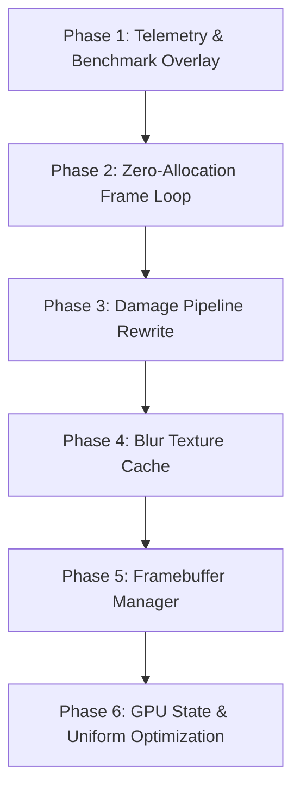

# MyGlass v1.2.0 — Performance Edition Architecture Plan

> **Core Goal**: *"Same visuals, significantly lower GPU usage, lower RAM usage, and faster rendering."*

---

## 🏁 Phase Exit Criteria

A phase is marked **complete** only when its exit criteria are verified by telemetry measurements under the benchmark protocol.

| Phase | Exit Criteria |
|---|---|
| **Phase 1: Telemetry & Overlay** | Overlay reports real-time CPU/GPU frame time, draw calls, FBO counts, VRAM, allocations/frame, and blur passes with **< 1% CPU overhead**. |
| **Phase 2: Zero-Allocation Frame Loop** | **0 heap allocations** (`new`, `delete`, `malloc`, vector resizing, string creation) during active steady-state render loops. |
| **Phase 3: Damage Pipeline** | Blur passes execute **strictly on damaged bounding regions**; unchanged regions perform zero blur work. |
| **Phase 4: Blur Cache** | Static desktop reuses cached blur textures with 100% correct invalidation when window position/content changes. |
| **Phase 5: Framebuffer Manager** | **0 FBO creations/destructions** during steady-state rendering; idle buffers are reclaimed after timeout without memory leaks. |
| **Phase 6: GPU State Optimization** | Redundant shader binds, FBO binds, texture unit binds, and `glUniform*` uploads reduced to near zero. |

---

## 🧪 Standardized Benchmark Scene Protocol

To ensure reproducible metrics across commits, all benchmarks are executed against a standardized test workload:

- **Environment**: 3 Monitor setups (or simulated multi-output viewports), Waybar, SwayNC, Quickshell.
- **Window Load**: 25 transparent windows across tiled and floating layouts.
- **Workload Test Phases**:
  1. **Idle Test (60s)**: Completely static desktop with zero user input.
  2. **Movement Test (60s)**: Continuous window dragging across monitors.
  3. **Resize Stress Test (60s)**: Rapid window resizing and workspace switching.

---

## 📊 Phase-by-Phase Benchmark Tracking

Every phase's results will be recorded in this comparison table as implementation progresses:

| Metric | v1.1.0 Baseline | Phase 1 | Phase 2 | Phase 3 | Phase 4 | Phase 5 | Phase 6 | Target Goal |
|---|---:|---:|---:|---:|---:|---:|---:|---:|
| **CPU Frame Time** | 6.0 ms | | | | | | | **< 4.5 ms** |
| **GPU Frame Time** | 5.2 ms | | | | | | | **< 3.5 ms** |
| **RAM Usage** | 70 MB | | | | | | | **< 50 MB** |
| **VRAM Usage** | 120 MB | | | | | | | **< 90 MB** |
| **Blur Passes** | 100% | | | | | | | **Damage Only** |
| **Allocations / Frame** | ~47 | | | | | | | **0** |

---

## 🏗️ Phased Architecture Roadmap

### Phase 1 — Benchmark First & Telemetry Overlay
- Add CPU/GPU timer queries, allocation hooks, and optional HUD overlay (`#ifdef DEBUG_OVERLAY`).
- Track CPU frame time, GPU render time, draw calls, FBO counts, VRAM, and blur passes.

### Phase 2 — Zero Allocation Frame Loop
- Replace per-frame allocations (`std::vector` resize, `std::string` formatting, map lookups) with fixed inline buffers and pre-allocated storage.

### Phase 3 — Damage Pipeline Rewrite
- Bounding-box scissor cropping for background sampling and Gaussian blur passes.

### Phase 4 — Blur Texture Cache
- Cache blurred textures per window/layer surface; invalidate on scene generation bump or transform updates.

### Phase 5 — Framebuffer Manager
- Manage pool of `SP<Render::IFramebuffer>` with dimension matchers and idle eviction.

### Phase 6 — GPU State & Uniform Upload Optimization
- Track active GL state and uniform values to eliminate redundant state shifts.
