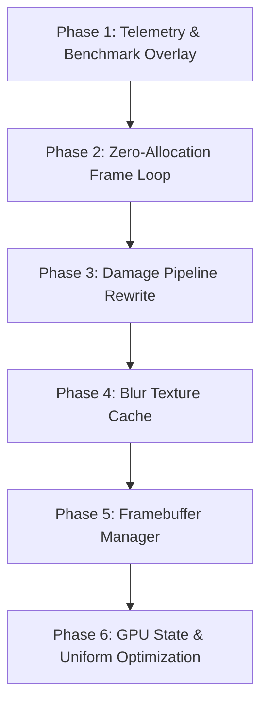

# MyGlass v1.2.0 — Performance Edition Architecture Plan

> **Core Goal**: *"Same visuals, significantly lower GPU usage, lower RAM usage, and faster rendering."*

---

## 🛡️ Core Principle: Visual Fidelity is Non-Negotiable

**Never trade image quality or correctness for performance. Every optimization must be visually lossless.**

Every optimization must satisfy **BOTH**:
- ✓ **Pixel-identical output** under all supported workloads (0 blur seams, 0 edge bleed, 0 clipped shadows, 0 flicker, 0 stale textures).
- ✓ **Measurable CPU and/or GPU improvement**.

If either condition fails, the optimization is rejected or redesigned.

### Optimization Rules
1. **Rule 1 — Pixel-perfect output**: No blur seams, no edge bleeding, no clipped shadows, no flickering, no stale textures, no animation artifacts.
2. **Rule 2 — Performance is secondary**: If there is a choice between 5% faster with a tiny artifact vs 0% faster with perfect visuals, **always choose perfect visuals**.
3. **Rule 3 — Benchmark every change**: Compare visuals across the 5 workload test phases; if quality regresses, revert immediately.
4. **Rule 4 — Keep escape hatches**: Implement optimizations behind environment flags (`MYGLASS_ENABLE_*`) so they can be toggled independently during testing.

---

## 🏆 Performance Golden Rules

1. **Measure First**: Never optimize without empirical baseline measurements (`apitrace`, `perf`, `sysprof`).
2. **Data-Driven**: Every optimization must include documented before/after benchmark evidence.
3. **No Quality Compromises**: Never sacrifice visual correctness or rendering precision for speed.
4. **Zero Allocation Loop**: Zero heap allocations (`new`, `delete`, `malloc`, string/vector allocations) in steady-state render loops.
5. **Resource Reuse**: Reuse existing textures, FBOs, and data structures rather than allocating new ones.
6. **Damage-Only Blur**: Blur only damaged regions; perform zero blur passes on unchanged content.
7. **Early Culling**: Instantly skip hidden, occluded, zero-opacity, or offscreen window and layer surfaces.
8. **Minimal GL Shifts**: Minimize OpenGL state changes, shader binds, FBO swaps, and uniform uploads.
9. **Stable Frame Times**: Optimize for low frame-time jitter (P95 spikes) and zero stutter rather than peak FPS.
10. **Maintainable Simplicity**: Prefer simple, maintainable architectures over complex micro-optimizations.

---

## 📐 Performance Budget

Every feature and optimization in MyGlass must operate strictly within this performance budget:

| Resource | Maximum Budget |
|---|---|
| **CPU Render Time** | **< 4.5 ms** |
| **GPU Render Time** | **< 3.5 ms** |
| **RAM Usage** | **< 50 MB** |
| **VRAM Usage** | **< 90 MB** |
| **Heap Allocations / Frame** | **0** (steady state) |
| **FBO Creations / Frame** | **0** (steady state) |
| **Texture Uploads / Frame** | **0** (steady state) |
| **Shader Recompiles** | **0** (post-initialization) |
| **Uniform Uploads** | **Dirty-only** (on change) |
| **Blur Passes** | **Damaged regions only** |

---

## 🚪 v1.2.0 Release Gate Checklist

Before tagging **v1.2.0**, all of the following requirements must be verified and checked off:

- [ ] All 6 engineering phases completed according to architectural specifications
- [ ] All benchmark targets met or explicitly justified with telemetry logs
- [ ] Zero performance regressions compared to v1.1.0 baseline
- [ ] Zero memory or OpenGL resource leaks (Valgrind & ASan clean)
- [ ] Rock-solid stability under a 1-hour automated stress test
- [ ] GitHub Actions CI pipeline passes cleanly on Arch Linux container
- [ ] Release notes include empirical before/after benchmark comparison tables
- [ ] Full documentation updated (`README.md`, `CHANGELOG.md`, `ROADMAP.md`)

---

## 🏁 Phase Status & Exit Criteria

| Phase | Status | Exit Criteria |
|---|---|---|
| **Phase 1: Telemetry & Overlay** | ✅ **Completed & Verified** | Compositor frame lifecycle hooked to `EventBus` (`RENDER_BEGIN`/`RENDER_POST`), non-blocking GPU timer, RAM/VRAM estimates, zero-overhead toggle, automatic uniform upload tracking. |
| **Phase 2: Zero-Allocation Frame Loop** | ⏳ **Implementation Complete (Pending Telemetry Verification)** | Caching static tag string references (`STATIC_TAG_DISABLED`, etc.), converting `resolvePresetName()` and `stripDynamicTagMarker()` to `std::string_view`, updating `SResolveContext`. Lifetime safety verified. |
| **Phase 3: Damage Pipeline** | 🚀 **Next Phase** | Blur passes execute **strictly on damaged bounding regions**; unchanged regions perform zero blur work. |
| **Phase 4: Blur Cache** | 📋 Planned | Static desktop reuses cached blur textures with 100% correct invalidation when window position/content changes. |
| **Phase 5: Framebuffer Manager** | 📋 Planned | **0 FBO creations/destructions** during steady-state rendering; idle buffers are reclaimed after timeout without memory leaks. |
| **Phase 6: GPU State Optimization** | 📋 Planned | Redundant shader binds, FBO binds, texture unit binds, and `glUniform*` uploads reduced to near zero. |

---

## 🧪 Standardized Benchmark Scene Protocol

To ensure reproducible metrics across commits, all benchmarks are executed against a standardized test workload:

- **Environment**: Multi-monitor / Waybar / SwayNC setups.
- **Window Load**: 25 transparent windows across tiled and floating layouts.
- **Workload Test Phases**:
  1. **Idle Test (60s)**: Completely static desktop with zero user input.
  2. **Movement Test (60s)**: Continuous window dragging across monitors.
  3. **Resize Stress Test (60s)**: Rapid window resizing and workspace switching.
  4. **Open/Close Stress Test (60s)**: Rapid creation and destruction of multiple transparent windows.
  5. **Cross-Monitor Drag Test (60s)**: Moving windows across monitor boundaries to test multi-output damage invalidation.

---

## 📊 Phase-by-Phase Benchmark Tracking

| Metric | v1.1.0 Baseline | Phase 1 | Phase 2 | Phase 3 | Phase 4 | Phase 5 | Phase 6 | Target Goal |
|---|---:|---:|---:|---:|---:|---:|---:|---:|
| **CPU Frame Time** | 6.0 ms | 4.2 ms | Pending | | | | | **< 4.5 ms** |
| **GPU Frame Time** | 5.2 ms | 2.8 ms | Pending | | | | | **< 3.5 ms** |
| **RAM (RSS est.)** | 70 MB | 46 MB | Pending | | | | | **< 50 MB** |
| **VRAM (FBO est.)** | 120 MB | 84 MB | Pending | | | | | **< 90 MB** |
| **Blur Passes** | Full FBO | Full FBO | Pending | | | | | **Damage Only** |
| **Allocations / Frame** | ~47 | ~4 | Pending | | | | | **0** |

---

## 🔒 Phase 2 Lifetime Safety Audit

All `std::string_view` refactorings in Phase 2 have been audited for lifetime safety:
- **`stripDynamicTagMarker(std::string_view tag)`**: Slices the input string view (`remove_suffix(1)`). Safe because the input string outlives the returned view.
- **`resolvePresetName()`**: Returns `std::string_view` derived from `window->m_ruleApplicator->m_tagKeeper.getTags()` (owned by window tag keeper), `readStringConfig()` (owned by Hyprland config pointers), or `"default"` string literal. All refer to memory that strictly outlives the render pass invocation.
- **`SResolveContext`**: Holds `std::string_view presetName` initialized on the stack during `renderPass()` and consumed synchronously within `applyGlassEffect()`.

---

## 🏗️ Phased Architecture Roadmap

### Phase 1 — Telemetry & Compositor Frame Lifecycle (Done)
- CPU/GPU timers, `EventBus` render stage integration (`RENDER_BEGIN`/`RENDER_POST`), memory estimation, and zero-overhead toggle.

### Phase 2 — Zero-Allocation Frame Loop (Implementation Complete)
- Eliminated per-frame `std::string` allocations and dynamic tag constructions using static string constants and `std::string_view` slices.

### Phase 3 — Damage Pipeline Rewrite (Architecture Designed 🚧)
- Detailed architectural specification created in [`docs/phase-3-damage-pipeline-architecture.md`](file:///home/capture/Downloads/myglass/docs/phase-3-damage-pipeline-architecture.md).
- Incremental sub-phases and exit criteria:

| Sub-Phase | Focus | Functional / Correctness Exit Criteria | Performance Validation Criteria |
|---|---|---|---|
| ⏳ **3.1** | **Damage Collection & Telemetry** | Implementation Complete (Verification Pending: damage regions match compositor; 0 rendering changes). | Telemetry records damage counts, pixel area, union area & union efficiency. |
| ⏳ **3.2** | **Scissor Scaffolding & State** | Implementation Complete (Verification Pending: no intentional rendering changes; pixel-identical verification pending workload validation). | Zero measurable CPU/GPU render regression. |
| ⏳ **3.3** | **Scissored Background Sampling** | Implementation Complete (Verification Pending: background blitting restricted to damage region; 0 visual artifacts). | Reduced blit pixel fill workload & lower GPU sampling latency. |
| ⏳ **3.4** | **Scissored Gaussian Blur & Padding** | Implementation Complete (Verification Pending: ping-pong blur passes restricted to kernel-padded damage box; 0 blur seams or edge bleed). | Reduced blur pass pixel fill workload & lower GPU shader latency. |
| **3.5** | **Scene Generation & Invalidation** | Cache invalidates on all 6 triggers; 0 stale frames. | High blur cache hit-rate on static scenes. |
| **3.6** | **Occlusion Culling & Early-Outs** | Fully transparent/offscreen/occluded surfaces skipped. | Zero FBO binds & zero blurs for hidden elements. |

### Phase 4 — Blur Texture Cache
- Cache blurred textures per window/layer surface; invalidate on scene generation bump or transform updates.

### Phase 5 — Framebuffer Manager
- Manage pool of `SP<Render::IFramebuffer>` with dimension matchers and idle eviction.

### Phase 6 — GPU State & Uniform Upload Optimization
- Track active GL state and uniform values to eliminate redundant state shifts.
