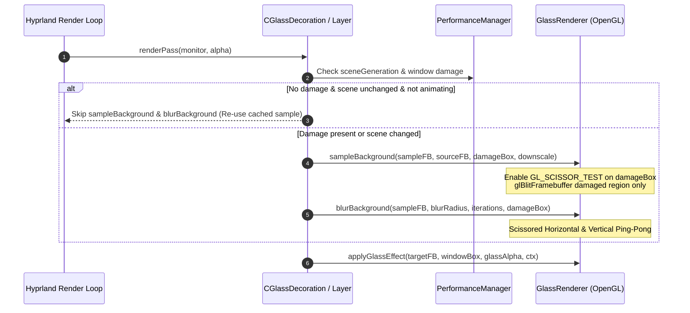

# Phase 3: Damage Pipeline Rewrite — Architectural Specification

> **Module**: `MyGlass` Renderer Subsystem  
> **Target Release**: v1.2.0 Performance Edition  
> **Status**: Architectural Specification (Pre-Implementation Phase 3)

---

## 1. Executive Summary & Goals

Currently, when a window or layer surface requests glass decoration, background sampling and 2-pass horizontal/vertical Gaussian blur are performed across the entire window bounding box (or downscaled sample FBO), even if only a small 10×10 pixel region of the window or background was damaged.

### Performance Goals
- **50%–90% reduction in GPU pixel fill-rate** during typical desktop usage (cursor movements, typing in terminals, small damage updates).
- **Zero blur passes** on completely unchanged windows/layers.
- **Zero visual artifacts, seams, or edge color bleeding** along scissor boundaries.

---

## 2. Mathematical Model & Kernel Padding

Gaussian blur is a spatially extended convolution filter. Sampling a damaged region `D` without kernel padding causes outer pixels to sample uninitialized GPU memory or black background pixels outside the damage bounds.

```
┌─────────────────────────────────────────────────────────────┐
│ Expanded Sample Scissor Box S                               │
│  ┌───────────────────────────────────────────────────────┐  │
│  │ Damaged Region D                                      │  │
│  │                                                       │  │
│  │               Kernel Radius R                         │  │
│  │         ◄────────────────────────►                    │  │
│  └───────────────────────────────────────────────────────┘  │
└─────────────────────────────────────────────────────────────┘
```

### Padding Formula
For a given downscale factor `downscale` (1 or 2), blur strength `blurStrength` (0.0 to 1.0), and iteration count `iterations` (1 to 5):

```text
R_base  = (blurStrength * 12.0) / downscale
padding = ceil(R_base * sqrt(iterations)) + 4
```

Where `+ 4` pixels is safety margin for bilinear filtering taps along FBO borders.

---

## 3. Damage Region Union & Scissor Math

### A. Monitor Coordinate Transformation
Hyprland damage is accumulated per monitor in `CMonitor` transformed display coordinates.

```cpp
CBox computeDamagedSampleBox(
    const CBox& windowBox,
    const Hyprutils::Math::CRegion& damageRegion,
    int padPx,
    int downscale
) {
    // 1. Intersect window box with active damage region
    CRegion windowDamage = damageRegion.intersect(windowBox);
    if (windowDamage.empty())
        return CBox{0, 0, 0, 0};

    // 2. Get tight bounding box of damage inside window
    CBox damageBox = windowDamage.getExtents();

    // 3. Expand by kernel padding for Gaussian tap coverage
    damageBox.expand(padPx);

    // 4. Clamp expanded box to window bounds
    damageBox = damageBox.intersect(windowBox);

    // 5. Downscale box for sample FBO space
    damageBox.x = std::floor(damageBox.x / downscale);
    damageBox.y = std::floor(damageBox.y / downscale);
    damageBox.width = std::ceil(damageBox.width / downscale);
    damageBox.height = std::ceil(damageBox.height / downscale);

    return damageBox;
}
```

---

## 4. Pipeline Execution Flow



---

## 5. Invalidation & State Rules

The cached blur sample for a window/layer MUST be invalidated and re-rendered if ANY of the following conditions occur:

1. **Scene Generation Bump**: `g_pGlobalState->getSceneGeneration(monitor) != m_lastSceneGeneration` (background content changed).
2. **Window Motion**: `windowBox.x != m_lastPosition.x || windowBox.y != m_lastPosition.y`.
3. **Window Resize**: `windowBox.width != m_lastSize.x || windowBox.height != m_lastSize.y`.
4. **Workspace Animation**: Active workspace or window workspace `renderOffset->isBeingAnimated() == true`.
5. **Preset / Theme Change**: Preset, brightness, contrast, or blur strength modified via Lua / Hyprlang config reload.
6. **First Render**: `!m_hasCachedSample`.

---

## 6. Multi-Monitor & Transform Safety

When monitors are rotated (90°, 180°, 270°):
- `g_pHyprRenderer->m_renderData.pMonitor->m_transform` swaps `x/y` coordinates.
- Scissor boxes and viewport dimensions passed to `g_pHyprOpenGL->setViewport()` MUST match the destination framebuffer's physical orientation, not the un-transformed logical monitor dimensions.

---

## 7. Occlusion & Skip Culling

A window or layer surface pass is **instantly skipped** (0 draw calls, 0 FBO binds, 0 blur passes) if:
- `alpha < 0.001f` (completely transparent).
- `windowBox.width <= 0 || windowBox.height <= 0` (zero size).
- Window box is entirely offscreen relative to the target monitor viewport bounds.
- Window is completely covered by an opaque fullscreen window (`window->m_isOpaque && window->m_isFullscreen`).

---

## 8. Incremental Sub-Phase Roadmap & Exit Criteria

To maintain build stability and allow isolated benchmark verification, Phase 3 is divided into 6 distinct sub-milestones with explicit functional and performance exit criteria:

| Sub-Phase | Focus | Functional / Correctness Exit Criteria | Performance Validation Criteria |
|---|---|---|---|
| **3.1** | **Damage Collection & Telemetry** | Damage regions collected match compositor exactly; 0 rendering changes. | Telemetry records damage region counts correctly. |
| **3.2** | **Scissor Scaffolding & State** | 100% pixel-identical output compared to baseline (0 seams/artifacts). | Zero measurable CPU/GPU render regression. |
| **3.3** | **Scissored Background Sampling** | Background sampling (`glBlitFramebuffer`) limited to damaged bounds. | Reduced blit pixel fill workload. |
| **3.4** | **Scissored Gaussian Blur & Padding** | Ping-pong blur passes restricted to padded damage boxes; 0 edge bleed. | Reduced blur pass pixel fill workload. |
| **3.5** | **Scene Generation & Invalidation** | Cache invalidates correctly for all 6 documented triggers; 0 stale frames. | High blur cache hit-rate on static scenes. |
| **3.6** | **Occlusion Culling & Early-Outs** | Fully transparent, offscreen, or occluded surfaces skipped with 0 regressions. | Zero FBO binds & zero blur passes for hidden/transparent elements. |

---

### Detailed Sub-Phase Specifications

### 3.1 — Damage Collection & Telemetry
- Capture monitor damage regions (`m_renderData.damage`).
- Add telemetry tracking for damage region counts and pixel bounds.
- Zero visual or rendering logic changes.

### 3.2 — Scissor Scaffolding
- Implement `g_pHyprOpenGL->scissor()` bounds setup.
- Verify zero visual changes or tile seam regressions.

### 3.3 — Scissored Background Sampling
- Apply `GL_SCISSOR_TEST` to `sampleBackground` `glBlitFramebuffer`.
- Benchmark GPU fill-rate reduction on blit passes.

### 3.4 — Scissored Gaussian Blur & Kernel Padding
- Restrict ping-pong blur passes to padded damage boxes.
- Verify kernel padding eliminates edge bleed and pixelation.

### 3.5 — Scene Generation & Cache Invalidation Matrix
- Wire `sceneGeneration` bump tracking per monitor.
- Re-use cached blur textures on static backgrounds with 100% accurate invalidation on window movement/resize.

### 3.6 — Occlusion Culling & Early-Outs
- Skip zero-opacity, offscreen, and occluded surfaces.
- Measure final CPU/GPU frame time improvements.

---

## 9. Telemetry & Verification Protocol

Phase 3 implementation will report the following new metrics via `CPerformanceManager`:
- `m_metrics.damageRegions`: Number of distinct scissored damage regions processed per frame.
- `m_metrics.blurPasses`: Incremented only when a scissored blur pass executes; remains 0 on idle frames.
- `m_metrics.skippedBlurs`: Incremented when an unchanged window reuses its cached sample.

### Exit Criteria
1. Idle static desktop: **0 blur passes / frame**, **0 FBO allocations / frame**.
2. Typing in terminal (small damage): **> 70% reduction in blurred pixel area** vs full FBO blur.
3. Dragging window: Smooth 60+ FPS rendering with **< 3.5 ms GPU frame time**.
